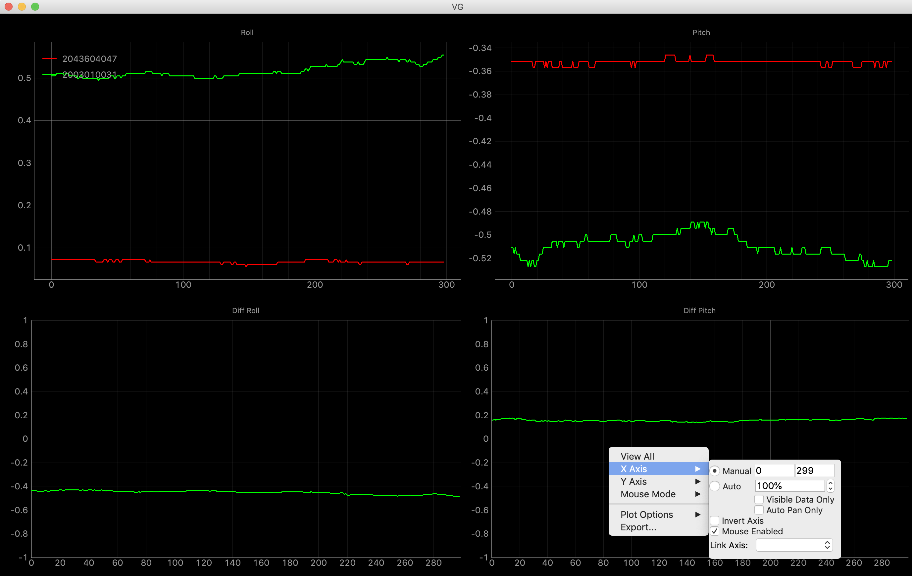

# logger

## Requirements
    pip install:
        pyserial
        numpy

## Basic Modules
1. application_base.py: Application Base Class. 
2. communicator.py: Serial port, TCP/IP and binaray file operration classes.
3. gps.py: Get UTC time according to given GPS week and seconds.
4. can_parser.py: Parse CAN message.
   
## Applications
### imu_logger.py
Log IMU data.

### multi_logger.py
A warpper for logging multi-IMUs data at the same time.

### show.py
A warpper of 'app_painter.py' to draw roll, pitch, diff-roll and diff-pitch in real time.

    Requirements:
        # pyqt5
        python3 -m pip install pyqt5 -i https://pypi.douban.com/simple/  
        # install pyqtgraph from source code.
        git clone https://github.com/pyqtgraph/pyqtgraph
        python setup.py install

### merge_files.py
Read and parse log files generated by 'IMU Viewer'.

### novatel.py
Parse Novatel ASCII log, and save [time,lla, roll, pitch] to csv log.

### convert_TV_data.py
Read and parse TV raw data.

### can_reader.py
Read and parse BLF, ASC and log file of CAN Tester.

### can_sender.py
Continuously and periodically send fake CAN message for testing.
Requires PI and PiCAN board 'RS485 CAN HAT'.

### can_receiver.py
Receive and parse CAN message.
Requires PI and PiCAN board 'RS485 CAN HAT'.

### carola_driver.py
Convert Carola velocity CAN message to standard J1939 CAN message.
Requires PI and PiCAN board 'RS485 CAN HAT'.

